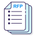

# Buku

### Kandungan:
- [Buku](#about-us)
- [Bahan rujukan karya asli](#-course-high-performance-data-processing)
    - [Contents:](#contents)

## Pengenalan
**Buku Karya Asli** adalah buku yang menunjukkan kreativiti dan originaliti penulis dalam menyampaikan idea, ilmu, atau pengalaman mereka. Buku Karya Asli tidak menyalin atau meniru karya orang lain tanpa memberi rujukan yang jelas. Buku Karya Asli juga tidak merupakan hasil terjemahan daripada bahasa lain, melainkan ia adalah karya asal penulis dalam bahasa tersebut. Buku Karya Asli biasanya mempunyai hak cipta yang terpelihara oleh penulis atau penerbit.

[Penerbit UTM Press](https://penerbit.utm.my/) ditubuhkan dengan matlamat untuk menyediakan perkhidmatan bagi membantu dan menggalakkan kakitangan akademik untuk menghasilkan karya asli atau karya terjemahan untuk kegunaan pengajaran dan pembelajaran dan untuk bahan bacaan umum kepada orang ramai. Penerbitan buku karya asli di Penerbit UTM Press boleh dikategorikan sebagai

#### 1. Buku Teks
Buku Teks adalah buku yang mengandungi ilmu tentang sesuatu subjek yang digunakan oleh guru dan pelajar sebagai bahan pengajaran dan pembelajaran.

#### 2. Buku Rujukan 
Buku Rujukan adalah bahan penerbitan yang digunakan sebagai rujukan untuk mendapatkan penjelasan lanjut tentang sesuatu perkara (untuk pembelajaran, kerja makmal, dan sebagainya).

#### 3. Buku Umum 
Buku Umum adalah bahan bacaan yang berkaitan dengan perkara-perkara umum dan boleh menarik minat orang ramai. (Diubahsuai daripada Kamus Dewan Edisi Keempat)

## Ciri-ciri Buku Karya Asli yang baik
### 1. Bilangan penulis
Buku karya asli yang baik sebaiknya ditulis oleh tidak lebih daripada **tiga orang** penulis. Ini kerana jika terlalu ramai penulis, gaya penulisan dan sudut pandang mungkin tidak konsisten dan menyebabkan kekeliruan pembaca. Jika buku karya asli itu hendak dipertandingkan untuk **anugerah buku**, bilangan penulis juga perlu diambil kira kerana sesetengah anugerah buku mempunyai syarat tertentu mengenai bilangan penulis.

### 2. Bahasa
Buku karya asli yang baik menggunakan bahasa yang **mudah difahami** oleh pembaca sasaran. Bahasa yang digunakan juga perlu **betul dari aspek tatabahasanya**, termasuk ejaan, tanda baca, ayat pasif, dan sebagainya. Kesalahan tatabahasa boleh menjejaskan kredibiliti penulis dan mengurangkan minat pembaca. 

### 3. Reka letak
Buku karya asli yang baik mempunyai reka letak atau *typesetting* yang **menarik dan tidak membosankan**. Reka letak buku merangkumi saiz huruf, jarak antara baris, margin, penjajaran, dan sebagainya. Reka letak yang baik boleh meningkatkan keselesaan dan kepuasan pembaca, serta menonjolkan isi kandungan buku. Reka letak yang buruk pula boleh menyebabkan pembaca cepat letih, bosan, atau hilang fokus. Oleh itu, penulis perlu memilih reka letak yang sesuai dengan genre, tema, dan gaya buku karya asli mereka.

### 4. Bilangan halaman
Bilangan buku karya asli adalah **sekurang-kurangnya 100 halaman**. Ini adalah ukuran minimum yang biasanya digunakan untuk mengenal pasti buku karya asli yang mempunyai isi kandungan yang mencukupi dan mendalam. Panjang buku karya asli juga boleh menunjukkan usaha dan komitmen penulis dalam menulis buku tersebut.

### 5. Bilangan bab
Bilangan bab dalam buku karya asli adalah **sekurang-kurangnya lima bab**. Ini adalah jumlah minimum yang biasanya digunakan untuk membina rangka kerja dan organisasi buku karya asli. Bilangan bab yang ganjil, seperti **lima, tujuh, atau sembilan**, adalah lebih disukai kerana ia memberi kesan keseimbangan dan simetri kepada buku karya asli.

### 6. Judul
Buku karya asli yang baik mempunyai judul buku yang **tidak terlalu panjang**. Judul buku adalah elemen pertama yang menarik perhatian pembaca. Judul yang pendek dan padat adalah lebih menarik dan mudah diingati. Judul buku karya asli biasanya tidak melebihi **lima hingga tujuh patah perkataan**.

## Masalah dalam Penerbitan Buku Karya Asli
- **Jadual** yang digunakan dalam buku karya asli **tidak bertaip**. Jadual tersebut hanya dalam bentuk **foto** yang diambil daripada sumber lain. Ini menunjukkan ketidakprofesionalan dan ketidakseriusan penulis dalam menyediakan buku karya asli. Jadual yang tidak bertaip juga boleh menyukarkan pembaca untuk melihat dan memahami data yang disajikan.
- **Sumber rujukan** yang dirujuk dalam teks buku karya asli **tidak diberi petikan** atau **kutipan** yang jelas dan tepat. Ini menunjukkan ketidakjujuran dan ketidakbertanggungjawaban penulis dalam menggunakan karya orang lain. Sumber rujukan yang tidak diberi petikan juga boleh menyebabkan penulis didakwa melakukan **plagiat**, iaitu mencuri atau meniru karya orang lain tanpa memberi penghargaan.
- **Pembahagian kandungan bab** dalam buku karya asli **tidak mantap** dan **perlu ditambah baik**. Pembahagian kandungan bab yang tidak mantap boleh menunjukkan ketidakcekapan dan ketidakteraturan penulis dalam menyusun dan mengemukakan idea, ilmu, atau pengalaman mereka. Pembahagian kandungan bab yang tidak mantap juga boleh menyebabkan pembaca berasa keliru dan bosan dengan buku karya asli.
- **Plagiat** dan **laporan Turnitin** yang melebihi **20%**. Plagiat adalah perbuatan yang tidak bermoral dan tidak beretika dalam dunia akademik dan penerbitan. Plagiat bermaksud menyalin atau meniru karya orang lain tanpa memberi rujukan yang jelas. Laporan Turnitin adalah alat yang digunakan untuk mengesan tahap kesamaan atau plagiat dalam teks. Laporan Turnitin yang melebihi 20% menunjukkan bahawa teks tersebut mempunyai banyak bahagian yang sama atau serupa dengan karya orang lain. Ini menjejaskan kualiti dan originaliti buku karya asli.
- **Rujukan** yang digunakan dalam buku karya asli **telah lebih daripada lima tahun**. Rujukan yang lama boleh menunjukkan ketidakmesraan dan ketidakupdatean penulis dengan perkembangan terkini dalam bidang yang ditulis. Rujukan yang lama juga boleh menyebabkan maklumat yang disampaikan dalam buku karya asli tidak relevan atau tidak tepat dengan masa kini. Penulis sepatutnya menggunakan rujukan yang baru dan mutakhir untuk meningkatkan kebolehpercayaan dan kesahihan buku karya asli.
- **Resolusi foto** yang rendah digunakan oleh penulis dalam buku karya asli. Foto yang kabur dan jagged boleh menunjukkan ketidakpedulian dan ketidakcukupan penulis dalam menyediakan bahan sokongan yang berkualiti. Foto yang rendah resolusinya juga boleh menjejaskan estetika dan keselesaan pembaca terhadap buku karya asli. Penulis sepatutnya menggunakan foto yang jelas dan tajam untuk menambah daya tarikan dan kefahaman pembaca terhadap buku karya asli.
- **Manuskrip** buku karya asli adalah **hasil kerja orang lain** (contohnya pelajar). Penulis **tumpang nama** atau **mengaku karya orang lain** sebagai karya sendiri. Ini adalah perbuatan yang tidak jujur dan tidak bermaruah dalam dunia penerbitan. Penulis yang tumpang nama atau mengaku karya orang lain sebagai karya sendiri boleh didakwa melakukan plagiat atau penipuan. Penulis sepatutnya menulis buku karya asli dengan usaha dan kreativiti sendiri, tanpa bergantung kepada orang lain.
- Penulis **mewakilkan orang tengah** (contohnya pelajar) untuk **berhubung dengan pihak penerbit**. Ini adalah perbuatan yang tidak profesional dan tidak sopan dalam dunia penerbitan. Penulis yang mewakilkan orang tengah untuk berhubung dengan pihak penerbit boleh menimbulkan masalah komunikasi dan kerjasama antara kedua-dua pihak. Penulis sepatutnya berhubung secara langsung dengan pihak penerbit, tanpa melibatkan orang tengah yang tidak berkaitan.
- **Pembetulan semula teks** (*major correction*) yang diperlukan oleh pihak penerbit. Pembetulan semula teks yang besar dan banyak boleh menunjukkan ketidakmampuan dan ketidaksesuaian penulis dalam menulis buku karya asli. Pembetulan semula teks yang besar dan banyak juga boleh menambah kos dan masa penerbitan buku karya asli. Penulis sepatutnya menulis buku karya asli dengan teliti dan cermat, dengan mematuhi garis panduan dan kriteria yang ditetapkan oleh pihak penerbit.
- Penulis **gagal siapkan pembetulan** dalam **tempoh ditetapkan** oleh pihak penerbit. Ini adalah perbuatan yang tidak bertanggungjawab dan tidak menghormati pihak penerbit. Penulis yang gagal siapkan pembetulan dalam tempoh ditetapkan boleh menyebabkan penerbitan buku karya asli tertangguh atau terbatal. Penulis sepatutnya menyiapkan pembetulan dengan segera dan tepat, dengan mengikut jadual dan tarikh yang diberikan oleh pihak penerbit.
- **Penukaran atau pertambahan foto** dalam teks secara **last minute**. Ini adalah perbuatan yang tidak wajar dan tidak menghargai kerja pihak penerbit. Penulis yang menukar atau menambah foto dalam teks secara disaat akhir boleh menyebabkan reka letak buku karya asli terganggu atau terjejas. Penulis sepatutnya menentukan foto yang sesuai dan mencukupi sebelum menghantar manuskrip kepada pihak penerbit, dan tidak membuat sebarang perubahan yang tidak perlu selepas itu.

## Keperluan Penerbitan
Anda perlu mengikuti panduan ini apabila menulis manuskrip yang meliputi gaya penulisan, penyediaan manuskrip, dan maklumat tambahan.

### Manuskrip

1. Anda perlu menyerahkan **satu salinan cetak** manuskrip asal kepada Penerbit UTM Press.
2. Anda juga perlu menyerahkan **softcopy manuskrip** (Menggunakan Microsoft Word) yang mengandungi:
      - Kesemua bahan dalam **satu fail** **(wajib)**
      - Bahan-bahan yang berasingan dalam **fail-fail berasingan** **(wajib)**
      - Softcopy manuskrip hendaklah dihantar melalui emel ke **karyaasli@utm.my**  **(wajib)**

3. Anda boleh merujuk kepada **[PANDUAN](https://research.utm.my/wp-content/uploads/sites/11/2022/02/Revised-Guide-to-Construct-to-Original-Manuscript-1.docx)** untuk membina manuskrip dalam fail word. Untuk versi Bahasa Inggeris klik di sini **[GUIDELINES TO CONSTRUCT ORIGINAL MANUSCRIPT](https://research.utm.my/wp-content/uploads/sites/11/2022/02/Panduan-Membina-Manuskrip-Karya-Asli-Semakan-2022-1.docx)**
4. Anda juga boleh melihat **[ALIRAN KERJA PENERBITAN BUKU ASLI](https://penerbit.utm.my/wp-content/uploads/sites/11/2023/02/ORIGINAL-BOOK-PUBLICATION-WORKFLOW-STARTING-2023.pdf)** untuk mengetahui proses penerbitan buku asli.
5. Untuk rujukan menggunakan Gaya APA Edisi Ketujuh. Klik [di sini](https://penerbit.utm.my/wp-content/uploads/sites/11/2023/02/APA-STYLE-REFERENCE.pdf).

### Struktur manuskrip
Manuskrip dianggap lengkap apabila memenuhi semua syarat untuk menjadi sebuah buku. Secara umumnya, sebuah buku mengandungi tiga bahagian utama, iaitu Bahagian Depan, Teks Utama, dan Bahagian Belakang. Oleh itu, penulis mesti memastikan bahawa manuskrip yang disediakan mengandungi ketiga-tiga bahagian tersebut.

#### 1. Bahagian Depan
- (a) Kulit – Tajuk manuskrip dengan nama penulis
- (b) Tajuk manuskrip **(wajib)**
- (c) Halaman penghargaan (pilihan)
- (d) Senarai kandungan **(wajib)**
- (e) Senarai ilustrasi (pilihan)
- (f) Senarai jadual (pilihan)
- (g) Kata pengantar (pilihan)
- (h) Prakata **(wajib)**
- (i) Pengenalan (pilihan)
- (j) Pengakuan (pilihan)
- (k) Senarai singkatan/simbol (jika ada)

#### 2. Teks Utama
- (a) Tajuk dan penomboran Bahagian (jika ada)
- (b) Tajuk dan penomboran Bab **(wajib)**
- (c) Tajuk Segmen/Seksyen **(wajib)**
- (d) Penomboran Segmen/Seksyen (wajib kecuali untuk sains sosial)
- (e) Petikan/kutipan (jika ada)
- (f) Ilustrasi/jadual (jika ada)
- (g) Penomboran ilustrasi/jadual dengan kapsyen (jika ada)
- (h) Nota kaki/nota bab/nota akhir (jika ada)
- (i) Penomboran halaman **(wajib)**

#### 3. Bahagian Belakang
- (a) Lampiran (jika ada)
- (b) Senarai istilah (jika ada)
- (c) Glosari (pilihan)
- (d) Bibliografi/Rujukan **(wajib) -menggunakan Format APA**
- (e) Indeks **(wajib)**

#### 4. Maklumat untuk kulit belakang (Blurb)
- (a) Sinopsis **(wajib)**
- (b) Biodata & gambar penulis **(wajib) *gambar dalam format jpeg tidak kurang daripada 300 dpi**

#### 5. Maklumat tambahan
Semua bahan berhak cipta (ilustrasi, gambar, jadual, keratan akhbar atau majalah, artikel, dan akta) mesti mendapat pelepasan hak cipta daripada penerbit asal atau penganjur persidangan. (Surat pernyataan/hak pengeluaran semula daripada penerbit asal mesti dilampirkan.)

**Gaya penulisan Penerbit UTM Press**
1) Manuskrip mesti ditulis/merakam dengan kemas dan konsisten menggunakan saiz kertas **A4**, **jarak dua** dengan hanya satu sisi dicetak. Sila gunakan fon Times New Roman dengan saiz fon 12.
2) Penulis mesti memastikan bahawa setiap halaman teks mematuhi **margin yang dipiawai, iaitu 32mm (1.23”) dari sebelah kiri, 32mm (1.23”) dari sebelah kanan, 25mm (1.0”) dari atas, dan 32mm (1.23”) dari bawah.**
3) Apabila menyediakan manuskrip, penggunaan huruf besar, huruf condong, tanda baca, sistem penomboran akronim, ejaan, dan tatabahasa harus mengikut dan mengadaptasi *Gaya Dewan Edisi Ketiga.*
4) Penyediaan manuskrip sains dan kejuruteraan memerlukan perhatian teliti dan serius daripada penulis berkenaan konsistensi dalam penggunaan istilah, unit pengukuran, dimensi, simbol, formula matematik, tanda teknikal, dan sebagainya. Penggunaannya mesti mengikut piawaian yang ditetapkan dalam *Gaya Dewan Edisi Ketiga.*

## Penghantaran Manuskrip

- Manuskrip yang diserahkan kepada Penerbit UTM Press hendaklah mengandungi keseluruhan bahan dalam bentuk cetakan asal.
- Manuskrip hendaklah diserahkan dalam keadaan rata, iaitu tidak dilipat atau digulung atau sebarang keadaan yang boleh mengganggu proses penilaian oleh penilai dan hendaklah dimasukkan ke dalam sampul surat dengan pengikat lembaran yang kukuh. Pengikatan yang sesuai akan dilakukan oleh Penerbit UTM Press.
- Manuskrip yang diserahkan kepada Penerbit UTM Press hendaklah merupakan hasil pemikiran akhir penulis dalam penulisannya dan BUKAN draf yang akan diubah kemudian.
- Semua ilustrasi seperti fotografi, rajah, carta, graf, peta, dan lukisan hendaklah diserahkan dalam bentuk softcopy. Jika ilustrasi (dalam jpeg) telah diberi kapsyen dan nombor, kapsyen dan nombor tersebut hendaklah sama dengan yang terdapat dalam teks.
- Manuskrip yang ditulis dengan tangan yang diserahkan TIDAK akan diterima.
- Penulis bertanggungjawab untuk memastikan **Laporan Turnitin** adalah di bawah 20%. Laporan tersebut boleh dilakukan oleh penulis atau Penerbit UTM Press.  
- Lengkapkan **[Borang Pengakuan Penulis](https://research.utm.my/wp-content/uploads/sites/11/2022/02/Revised-Authors-declaration.docx)** dan [**Pengakuan Penyerahan Manuskrip**](https://research.utm.my/wp-content/uploads/sites/11/2022/02/Pengakuan-Penyerahan-Manuskrip-Semakan-2022.docx). Sila baca dan fahami terma dan syarat untuk memastikan proses penerbitan berjalan lancar.
- Sila hantar semua bahan di atas ke **karyaasli@utm.my**
- Salinan keras manuskrip boleh dihantar ke alamat ini:  
  >Penerbit UTM Press  
  >Universiti Teknologi Malaysia  
  >81310 Johor Bahru  
  >JOHOR, MALAYSIA  
  >att: Unit Buku Asli & Projek Khas  
  >Tel : 07-553 5670

## Buku yang dihasilkan oleh Mohd Shahizan dan rakan-rakan

### 1. Pengaturcaraan Web ASP. NET Menggunakan VB dan C#

 **ISBN:** 978-983-52-1098-3  
 **Ketebalan:** 571  
 **Web**: [Penerbit UTM Press](https://penerbit.utm.my/booksonline/pengaturcaraan-web-asp-net-menggunakan-vb-dan-c/) 

**Sinopsis:** 
Buku ini memberi pendedahan dan panduan kepada pembaca untuk membina laman web dengan menggunakan teknologi ASP.NET. Teknologi ASP.NET merupakan rangka kerja pengaturcaraan sebelah pelayan yang membolehkan pembangun laman web menghasilkan aplikasi web dan servis yang bersifat dinamik. Buku ini juga menerangkan tentang perisian Microsoft Visual Web Developer (MSVWD) yang diguna untuk menghasilkan laman web ASP.NET, kawalan piawai dan sintaks asas ASP.NET yang boleh digunakan oleh pengaturcara untuk menghasilkan laman web, struktur kawalan, rentetan, kawalan pengesahsahihan, pangkalan data, dan bahasa pertanyaan berstruktur. Selain itu, buku ini turut menyediakan banyak contoh atur cara, latihan pengaturcaraan, dan cara membangunkan aplikasi web yang melibatkan penggunaan pangkalan data bagi memahir dan mengukuhkan lagi penguasaan pembaca dalam pengaturcaraan web ASP.NET. Buku ini sesuai sebagai bahan pengajaran dan pembelajaran oleh pensyarah dan pelajar, rujukan kepada pengaturcara yang ingin mempelajari bahasa pengaturcaraan ASP.NET dengan lebih mendalam, serta pembaca umum yang berminat untuk mempelajari pengaturcaraan web dan membina laman web menggunakan ASP.NET dengan mudah dan berkesan.

### 2. Pembangunan Aplikasi Web menggunakan ASP.NET

 **ISBN:** 978-983-52-0757-0  
 **Ketebalan:** 514  
 **Web**: [Penerbit UTM Press](https://penerbit.utm.my/booksonline/pembangunan-aplikasi-web-menggunakan-asp-net/) 

**Sinopsis:** 
Buku ini memberi pendedahan dan panduan kepada pembaca untuk membangunkan aplikasi web dengan menggunakan ASP.NET. ASP.NET merupakan bahasa pengaturcaraan sebelah pelayan yang membolehkan pembangun laman web menghasilkan aplikasi web dan servis yang bersifat dinamik. Buku ini juga menerangkan tentang perisian Microsoft Visual Studio 2008 (MVS) yang digunakan untuk membangunkan aplikasi web dan penggunaan navigasi, tema dan Master Page bagi menghasilkan reka bentuk aplikasi web. Selain daripada itu, penerangan tentang pangkalan data, cara membangunkan pangkalan data, penggunaan data dalam pangkalan data, penghasilan laporan menggunakan Crystal Reports dan kawalan ReportViewer, penggunaan kawalan keselamatan, teknologi AJAX dan pemasangan aplikasi web pada pelayan web turut diterangkan dalam buku ini. Buku ini sesuai digunakan sebagai bahan pengajaran dan pembelajaran oleh pensyarah dan pelajar, rujukan kepada pengatur cara yang ingin mempelajari bahasa pengaturcaraan ASP.NET dengan lebih mendalam, serta pembaca umum yang berminat untuk mempelajari pengaturcaraan web dan membangunkan aplikasi web menggunakan ASP.NET dengan mudah dan berkesan.

### 3. Sistem Pangkalan Data

 **ISBN:** 978-983-52-0778-5  
 **Ketebalan:** 194  
 **Web**: [Penerbit UTM Press](https://penerbit.utm.my/booksonline/sistem-pangkalan-data/) 

**Sinopsis:** 
Sistem Pangkalan Data ditulis untuk membantu pembaca memahami konsep, mereka bentuk, dan membangunkan sistem pangkalan data. Buku ini dibahagikan kepada lapan bab bermula daripada penerangan tentang pengenalan dan persekitaran pangkalan data, mereka bentuk pangkalan data dengan menggunakan model data, penormalan dan penyemakan sifat jadual, dan diakhiri dengan manipulasi data menggunakan bahasa pertanyaan berstruktur. Setiap bab mempunyai soalan latihan yang boleh digunakan untuk menguji kefahaman pembaca terhadap bab-bab yang diikutinya. Buku ini sesuai digunakan sebagai bahan pengajaran dan pembelajaran oleh pensyarah, pelajar atau pembaca umum yang berminat untuk memahami sistem pangkalan data.

### 4. Pengkomputeran Selari

 **ISBN:** 978-983-52-0965-9  
 **Ketebalan:** 138  
 **Web**: [Penerbit UTM Press](https://penerbit.utm.my/booksonline/pengkomputeran-selari/) 

**Sinopsis:** 
Pengkomputeran selari merupakan gabungan berbilang pemproses atau berbilang teras yang tidak bersandar antara satu dengan yang lain dalam ruang memori dan beroperasi secara bersama. Teknologi ini telah digunakan dengan meluas dalam menyelesaikan pelbagai masalah fizikal yang bersifat global. Teknologi ini juga mampu melaksanakan proses pengiraan yang kompleks, iaitu mampu menampung ruang ingatan yang cukup besar dan menyelesaikan masalah yang melibatkan data ukuran yang sangat besar.     

### 5. Pengaturcaraan Pangkalan Data Menggunakan Oracle 11g

 **ISBN:** 978-983-52-0925-3  
 **Ketebalan:** 404  
 **Web**: [Penerbit UTM Press](https://penerbit.utm.my/booksonline/pengaturcaraan-pangkalan-data-menggunakan-oracle-11g/) 

**Sinopsis:** 
Pangkalan data merupakan komponen utama yang penting dalam pembangunan sistem maklumat. Penggunaan pangkalan data membenarkan data hanya ditakrif sekali sahaja. Oleh sebab pengguna tidak boleh mencapai terus data dari pangkalan data, maka perisian Sistem Pengurusan Pangkalan Data (SPPD), iaitu Oracle 11g diguna untuk membolehkan pengguna berinteraksi dengan pangkalan data. Buku ini memberi pendedahan dan panduan kepada pembaca untuk melaksanakan pengaturcaraan pangkalan data menggunakan Oracle 11g. Perbicangan dalam buku ini dimulakan dengan penerangan secara teori tentang web, pangkalan data, dan perisian sistem pengurusan pangkalan data, iaitu Oracle 11g. Kemudiannya, diikuti perbincangan tentang pelbagai elemen yang terdapat dalam bahasa pengaturcaraan pangkalan data, seperti membina pangkalan data, mencapai data menggunakan pernyataan Select, pembatasan dan isihan, rentetan, dan struktur kawalan. Buku ini turut menerangkan cara untuk membangunkan aplikasi web dengan menggunakan ASP.NET dan PHP. Selain itu, penerangan tentang cara menghasilkan laporan menggunakan kawalan ReportViewer dan Chart turut diterangkan dalam buku ini. Setiap bab disertakan contoh atau latihan yang berkaitan untuk menguji kefahaman pembaca terhadap bab-bab yang diikutinya. Buku ini sesuai digunakan sebagai bahan pengajaran dan pembelajaran oleh pensyarah dan pelajar, rujukan kepada pengaturcara yang ingin mempelajari pengaturcaraan pangkalan data Oracle 11g dengan lebih mendalam, serta pembaca umum yang berminat untuk mempelajari pengaturcaraan pangkalan data dan membangunkan aplikasi sistem dengan menggunakan pangkalan data Oracle 11g secara mudah dan berkesan.

### 6. Organisasi Maklumat

 **ISBN:** 978-983-52-0456-2  
 **Ketebalan:** 237  
 **Web**: [Penerbit UTM Press](https://penerbit.utm.my/booksonline/organisasi-maklumat/) 

**Sinopsis:** 
Organisasi maklumat bermula sebaik sahaja manusia mencipta bahasa dan menggunakannya bagi membolehkan maklumat disebarkan daripada seseorang kepada yang lain. Buku ini memberi penerangan menyeluruh mengenai bidang organisasi maklumat dengan memberi penekanan kepada maklumat atau pengetahuan yang telah pun direkod. Memandangkan maklumat boleh direkod dalam pelbagai jenis media, seseorang yang ingin memperolehi pengetahuan dan kemahiran mengorganisasi maklumat perlu mengetahui jenis, kegunaan dan keperluan untuk mengorganisasinya. Proses mengorganisasi sumber maklumat tidak lengkap jika tidak mengelaskannya. Menurut proses pengelasan, setiap bahan diberi satu nombor unik untuk menentukan lokasinya di rak. Buku ini turut mengenal pasti prinsip utama dan amalan berhubung dengan mendeskripsikan sumber maklumat. Prinsip asas klasifikasi terutamanya bagaimana mengkategori sumber maklumat mengikut bidang pengetahuan dan subjek khusus turut dibincangkan. Aspek lain seperti proses pengindeksan automatik dan pengorganisasian fail juga dihuraikan. Beberapa cadangan untuk memperbaiki sistem dalam talian turut dikemukakan. Antaranya aspek reka bentuk sistem sebagai penghubung rekod metadata untuk pakej maklumat yang ada dalam satu-satu domain.

### 7. Pengaturcaraan Web Hypertext Preprocessor (PHP)

 **ISBN:** 983-52-0405-5  
 **Ketebalan:** 354  
 **Web**: [Penerbit UTM Press](https://penerbit.utm.my/booksonline/pengaturcaraan-web-hypertext-preprocessor-php/) 

**Sinopsis:** 
Buku ini memperkenalkan kepada pembaca tentang asas pengaturcaraan web dalam Hypertext Preprocessor (PHP). Perbincangan awal dimula dengan memperkenalkan teknologi web dan perisian sumber terbuka. Kemudiannya, diikuti pengenalan kepada PHP yang merangkumi konsep, sejarah dan keperluan asas sebelum menulis atur cara PHP. Selain itu, terdapat beberapa bab yang menghuraikan pelbagai elemen bahasa pengaturcaraan. Antaranya struktur kawalan, fungsi, rentetan, dan tatasusunan. Bab akhir buku ini pula menerangkan tentang cara membangunkan aplikasi web menggunakan PHP, iaitu sistem penjanaan nombor dan variasi rawak. Buku ini juga turut menyediakan contoh atur cara dan latihan pengaturcaraan bagi memahir dan mengukuhkan lagi penguasaan pembaca dalam pengaturcaraan web. Buku ini sesuai sebagai bahan pengajaran dan pembelajaran oleh pensyarah dan pelajar, kepada pengaturcara yang ingin mempelajari bahasa penulisan skrip PHP dengan lebih mendalam, serta pembaca umum yang berminat untuk mengenali PHP dan ingin mempelajari asas pengaturcaraan web dengan mudah dan berkesan.

### 8. Pengaturcaraan Web ASP.NET

 **ISBN:** 978–983–52–0736–5  
 **Ketebalan:** 430  
 **Web**: [Penerbit UTM Press](https://penerbit.utm.my/booksonline/pengaturcaraan-web-asp-net/) 

**Sinopsis:** 
Buku ini memberi pendedahan dan panduan kepada pembaca untuk membina laman web dengan menggunakan teknologi ASP.NET. Teknologi ASP.NET merupakan rangka kerja pengaturcaraan sebelah pelayan yang membolehkan pembangun laman web menghasilkan aplikasi web dan servis yang bersifat dinamik. Buku ini juga menerangkan tentang perisian Microsoft Visual Web Developer (MSVWD) yang diguna untuk menghasilkan laman web ASP.NET, kawalan piawai dan sintaks asas ASP.NET yang boleh digunakan oleh pengaturcara untuk menghasilkan laman web, struktur kawalan, rentetan, kawalan pengesahsahihan, pangkalan data, dan bahasa pertanyaan berstruktur. Selain itu, buku ini turut menyediakan banyak contoh atur cara, latihan pengaturcaraan, dan cara membangunkan aplikasi web yang melibatkan penggunaan pangkalan data bagi memahir dan mengukuhkan lagi penguasaan pembaca dalam pengaturcaraan web ASP.NET. Buku ini sesuai sebagai bahan pengajaran dan pembelajaran oleh pensyarah dan pelajar, rujukan kepada pengaturcara yang ingin mempelajari bahasa pengaturcaraan ASP.NET dengan lebih mendalam, serta pembaca umum yang berminat untuk mempelajari pengaturcaraan web dan membina laman web menggunakan ASP.NET dengan mudah dan berkesan.

### 9. Microsoft SQL Server 2000: Teori dan Amali

 **ISBN:** 983-52-0354-7  
 **Ketebalan:** 212  
 **Web**: [Penerbit UTM Press](https://penerbit.utm.my/booksonline/microsoft-sql-server-2000-teori-dan-amali/) 

**Sinopsis:** 
Microsoft SQL Server 2000 merupakan salah satu penyelesaian Sistem Pengurusan Pangkalan Data (SPPD) yang digunakan secara meluas oleh kebanyakan organisasi pada masa kini. Buku ini ditulis untuk kegunaan para pelajar yang mengambil mata pelajaran pangkalan data dengan mengandaikan bahawa mereka telah mempunyai pengetahuan dalam SPPD. Justeru itu, buku ini akan memberi pendedahan kepada pembaca untuk membina satu sistem pangkalan data secara teori dan juga amali. Buku ini sesuai sebagai bahan pengajaran dan pembelajaran oleh pensyarah, pelajar dan juga pembaca yang berminat untuk membangunkan satu sistem pangkalan data menggunakan Microsoft SQL Server 2000.

### 10. Pembangunan Aplikasi Web Menggunakan Active Server Pages (ASP)

 **ISBN:** 978–983–52–0400–4  
 **Ketebalan:** 379  
 **Web**: [Penerbit UTM Press](https://penerbit.utm.my/booksonline/pengaturcaraan-web-asp-net/) 

**Sinopsis:** 
Persekitaran web menyediakan pelbagai teknologi serta komponen bagi tujuan pembangunan aplikasi web. Contoh teknologi atau komponen sedia ada yang boleh digunakan adalah seperti objek HTML piawai, skrip-pelanggan (JavaScript, VB Script), teknologi sebelah pelayan seperti Active Server Pages (ASP), Hypertext Preprocessor (PHP), dan Java Server Pages (JSP). Kepelbagaian ini membolehkan persekitaran web digunakan untuk pembangunan pelbagai jenis aplikasi web sama ada berbentuk konvensional, multimedia atau saintifik. Justeru itu, buku ini memberi pendedahan dan panduan kepada pembaca untuk membangunkan aplikasi web dengan menggunakan teknologi ASP. Selain itu, buku ini juga menerangkan tentang teknologi web secara umum, penggunaan sistem pengurusan pangkalan data dalam aplikasi web yang dibangunkan, penghasilan laporan dengan menggunakan Crystal Report dan cara menghasilkan laman web bagi troli pembelian. Sila layari laman web [Penerbit UTM Press](https://penerbit.utm.my/booksonline/pengaturcaraan-web-asp-net/) untuk memperoleh contoh aplikasi mudah yang telah dibangun dengan menggunakan teknologi ASP. Buku ini sesuai digunakan sebagai bahan pengajaran dan pembelajaran oleh pensyarah, pelajar mahupun pembaca umum yang berminat untuk membangunkan sistem aplikasi web menggunakan ASP.

## Bahan Rujukan Karya Asli

| No | Buku |  Penerangan |Fail |
| :-----: |------ | ------ | :-----: | 
| 1 | Umum | Jom tulis buku karya asli |   | 
| 2 | Pengaturcaraan Web ASP. NET Menggunakan VB dan C#  | Hakcipta |   |
| 3 | Pengaturcaraan Web ASP. NET Menggunakan VB dan C#  | Prilim dan Cover |   | 
| 4 | Pengaturcaraan Web ASP. NET Menggunakan VB dan C#  | Prakata|   | 
| 5 | Pengaturcaraan Web ASP. NET Menggunakan VB dan C#  | Blurb buku|   | 
| 6 | Pengaturcaraan Web ASP. NET Menggunakan VB dan C#  | Sinopsis|   | 
| 7 | Pengaturcaraan Web ASP. NET Menggunakan VB dan C#  | Contoh: Jadual kandungan|   | 
| 8 | Pengaturcaraan Web ASP. NET Menggunakan VB dan C#  | Contoh: Bab 1|   | 
| 9 | Pengaturcaraan Web ASP. NET Menggunakan VB dan C#  | Contoh: Bab 6|   | 
| 10 | Pengaturcaraan Web ASP. NET Menggunakan VB dan C#  | Contoh: Bab 9|   | 
| 11 | Pengkomputeran Selari  | Jadual kandungan|   | 

 
## Contribution 🛠️
Please create an [Issue](https://github.com/drshahizan/mybooks/issues) for any improvements, suggestions or errors in the content.

You can also contact me using [Linkedin](https://www.linkedin.com/in/drshahizan/) for any other queries or feedback.

